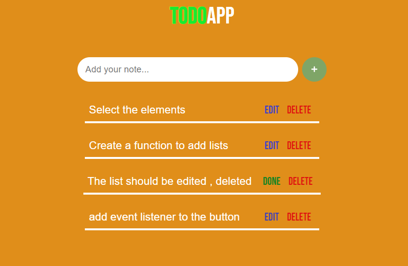

# ToDo App -JS
## Techniques used
- html
- css
- Java Script

### Time Taken: 4 hours

In this project I have created funtion to get value from input and add it to the task container.That added lists can be edited and deleted.

